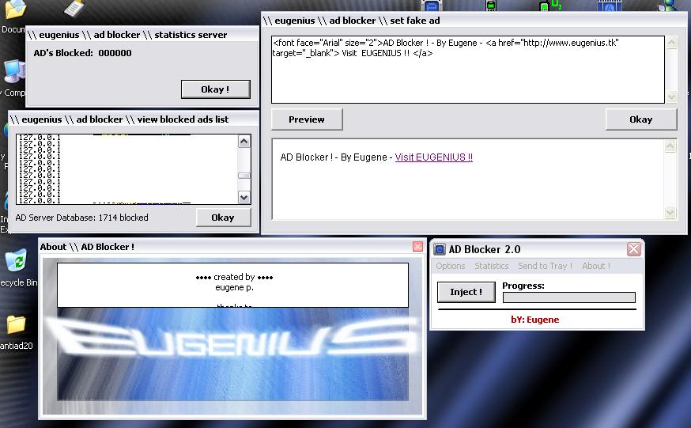



## AD Blocker v2\.0 \- Block ADs Before they are even DOWNLOADED \- NEW Features \!\!

### Description

STOP Internet Advertisements before they are even downloaded ! Here is a project I've been working on, fully coded and FULLY commented. In this you will learn how to use COMMAND LINE loading your VB program, how to SEND YOUR APPS to the SYSTEM TRAY, you will learn how to use WINSOCK CONROL and start a simple WEB SERVER, you will see how to SAVE/LOAD from LIST BOXES and how to OPEN Files for WRITE ACCESS then WRITE TO THEM ! PLUSE MORE !!
 
### More Info
 

             |
---                |---
**Submitted On**   |2002-11-26 17:03:00
**By**             |[Eugene P\.](https://github.com/Planet-Source-Code/PSCIndex/blob/master/ByAuthor/eugene-p.md)
**Level**          |Beginner
**User Rating**    |5.0 (20 globes from 4 users)
**Compatibility**  |VB 5\.0, VB 6\.0
**Category**       |[Internet/ HTML](https://github.com/Planet-Source-Code/PSCIndex/blob/master/ByCategory/internet-html__1-34.md)
**World**          |[Visual Basic](https://github.com/Planet-Source-Code/PSCIndex/blob/master/ByWorld/visual-basic.md)
**Archive File**   |[AD\_Blocker15040811262002\.zip](https://github.com/Planet-Source-Code/eugene-p-ad-blocker-v2-0-block-ads-before-they-are-even-downloaded-new-features__1-41078/archive/master.zip)

